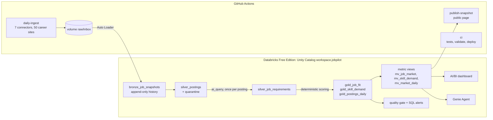

# JobPilot

**The India data-engineering job market, as a production lakehouse on Databricks.**
Every morning a pipeline snapshots 50 company career sites on seven platforms (Workday, Oracle Recruiting, SAP SuccessFactors, Amazon Jobs, Eightfold, Greenhouse, Lever), extracts each posting's requirements with an LLM,
scores how well it fits my profile, and serves the result through an AI/BI dashboard, a Genie Agent and a public page.

**Live snapshot:** https://hakalaka.github.io/jobpilot/ · **Built by** Piyush Chavan, Data Engineer



## What it demonstrates

| Area | How |
|---|---|
| **Ingestion** | Seven connectors (adapter pattern, one per careers platform: Workday, Oracle Recruiting, SAP SuccessFactors, Amazon Jobs, Eightfold, Greenhouse, Lever; see `docs/CONNECTORS.md`) run daily in GitHub Actions (Free Edition serverless has restricted internet) and land one JSON-lines file in a Unity Catalog volume. Auto Loader (`read_files` in a streaming table) loads each file exactly once. |
| **Lakeflow Declarative Pipeline** | `pipelines/ingest.sql`: an append-only bronze table, silver with **expectations** (bad rows dropped and kept in a quarantine table with the reason), and gold daily activity. Postings are open or closed by whether they appear in the latest snapshot. |
| **LLM enrichment, done like data engineering** | `ai_query` with a strict JSON schema, set-based over the batch. An anti join means each posting is sent **once**; `failOnError => false` isolates bad responses; results are materialised before they're read twice; a per-run cap bounds cost. |
| **Deterministic gold** | The fit score is plain, tested Python: the same input always gives the same score, and every point is explainable. **The LLM extracts; code decides.** Fully recomputed each run because it's cheap, while enrichment is incremental because it's expensive. |
| **Semantic layer** | Metric views define every KPI once; a fully commented view feeds Genie. Dashboard, Genie and the public page agree by construction. |
| **Consumption** | AI/BI dashboard as code (`tools/build_dashboard.py`), a Genie Agent with instructions, example SQL and benchmarks (`docs/GENIE.md`), and a public snapshot page. |
| **Operations** | Quality gate task (freshness, quarantine rate, LLM error rate, duplicates) that fails the job and blocks publishing; SQL alerts; email on failure; a runbook (`docs/RUNBOOK.md`). |
| **Everything as code** | One Declarative Automation Bundle: schema, volumes, pipeline, job, dashboard, alerts, app (and the Genie Agent after export). CI runs tests and `bundle validate` on every push and deploys on `main`. |
| **Privacy by design** | My contact details and application tracker live only in a private volume and private tables. A test fails CI if the public export ever queries them. |

## Repository

```
pipelines/ingest.sql          Lakeflow declarative pipeline: bronze, silver, quarantine, gold daily
notebooks/                    00 setup · 10 LLM enrichment · 20 scoring · 30 semantic layer · 40 resumes (private) · 50 quality gate
src/jobpilot/                 tested Python: ATS parsers, skill vocabulary, fit scoring, guardrails, prompts, resume renderer
resources/                    bundle resources: UC objects, pipeline, job, dashboard, alerts, app
dashboards/                   AI/BI dashboard JSON (generated by tools/build_dashboard.py)
site/                         public snapshot page (GitHub Pages)
.github/workflows/            ci · daily-ingest · discover-boards · publish-snapshot · export-genie
src/jobpilot/connectors/      Oracle, SuccessFactors, Amazon, Eightfold connectors (Workday, Greenhouse, Lever in ats.py)
config/                       career boards and filters, example profile
docs/                         Genie setup and benchmarks, runbook
app/                          private Databricks App: review tailored resumes, track applications
```

## Run it yourself

1. **Databricks Free Edition** account. Create a personal access token (**Settings → Developer**).
2. **Fork this repo** and add Actions secrets `DATABRICKS_HOST` and `DATABRICKS_TOKEN`. Set your host in `databricks.yml`.
3. **Enable Pages**: **Settings → Pages → Source: GitHub Actions**.
4. Run **ci** to deploy, **discover-boards** to verify the career boards, then **daily-ingest**.
5. Upload your own `master_profile.yaml` to the `private` volume (copy `config/master_profile.example.yaml`).
6. Build the Genie Agent with `docs/GENIE.md`, then run **export-genie**.

Local checks: `pip install -r requirements-dev.txt && PYTHONPATH=src pytest -q && python tools/demo_offline.py`

## Interview talking points

- *Why GitHub Actions for fetching?* Free Edition serverless restricts outbound internet. Separating fetch from compute is also the right pattern anyway: the landing zone is the contract.
- *Why is enrichment outside the declarative pipeline?* A materialized view can recompute, and an LLM call per row must happen exactly once. An incremental MERGE with an anti join makes that guarantee explicit.
- *How do you know the numbers are right?* Expectations and quarantine in silver, a blocking quality gate, alerts, Genie benchmarks, and one semantic layer for every consumer.
- *What would change at scale?* Ship `src/` as a wheel and score with `mapInPandas`; partition-free liquid clustering on `job_key`; batch inference endpoints for enrichment; a service principal instead of a PAT.
